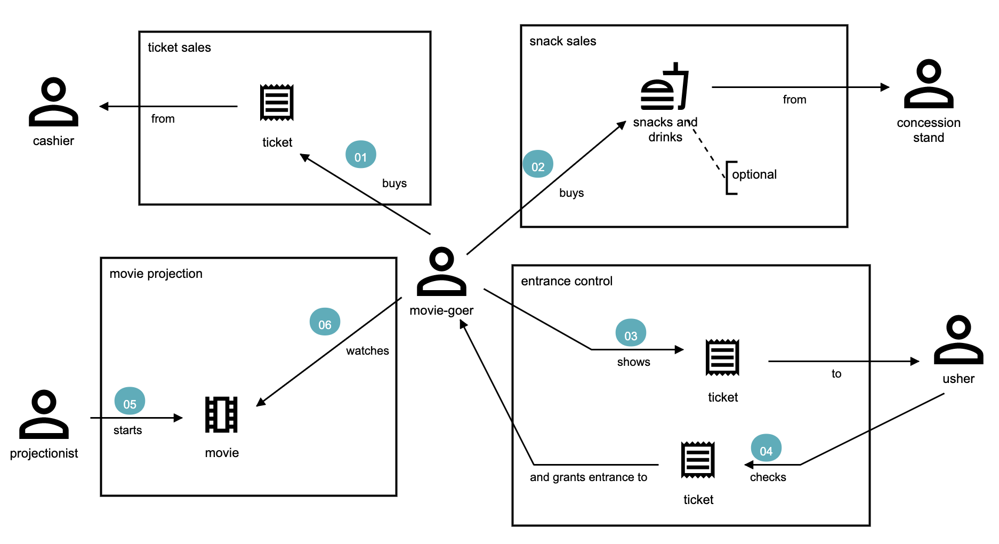

# Domain storytelling

[Domain storytelling](https://domainstorytelling.org/) helps to build a domain language and reach a shared understanding.

## Case study: Cinema

The diagram below illustrates an example case study from the Domain storytelling website. Through conversations between a domain expert we better understand the domain, in order to describe someone who wants to see a movie at a cinema.

### Models

DDD deals with large models by dividing them into different Bounded Contexts and being explicit about their interrelationships. - [Martin Fowler, 2014](https://www.martinfowler.com/bliki/BoundedContext.html)

The diagram illustrates the following relationships:

- A movie-goer buys tickets from a cashier.
- A movie-goer can buy snacks and drinks from a concession stand.
- A movie-goer shows their ticket to an usher.
- When shown a ticket the usher checks the ticket and grants access to the movie-goer who showed the ticket.
- A projectionist starts a movie.
- A movie-goer watches a movie started by the projectionist.

The models are the things we are talking about which are:

- Tickets
- Movies
- Food (snack and drinks)
